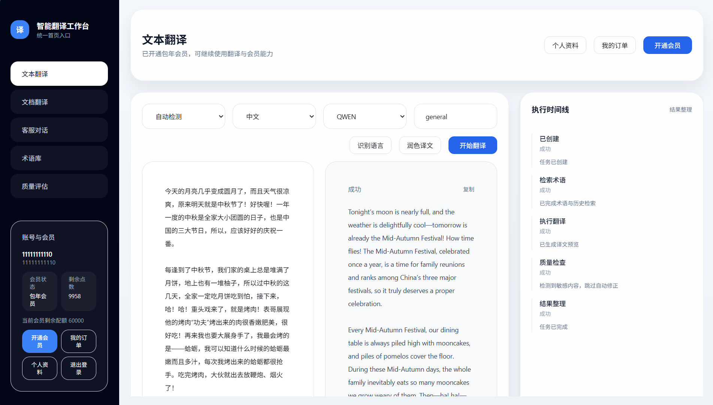
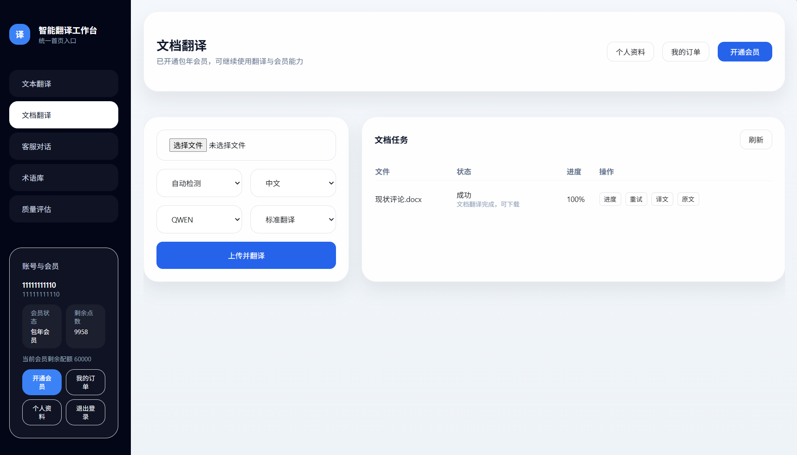
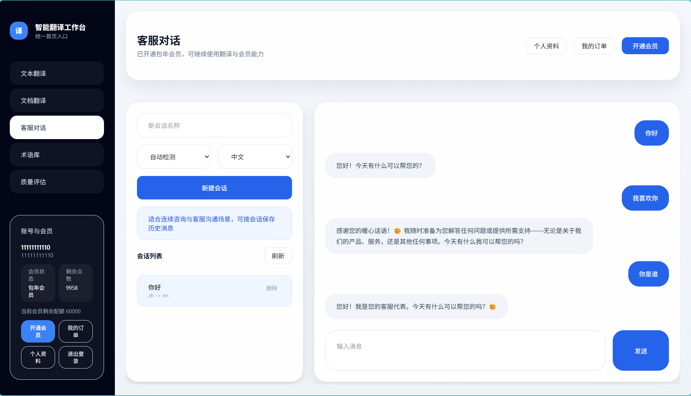
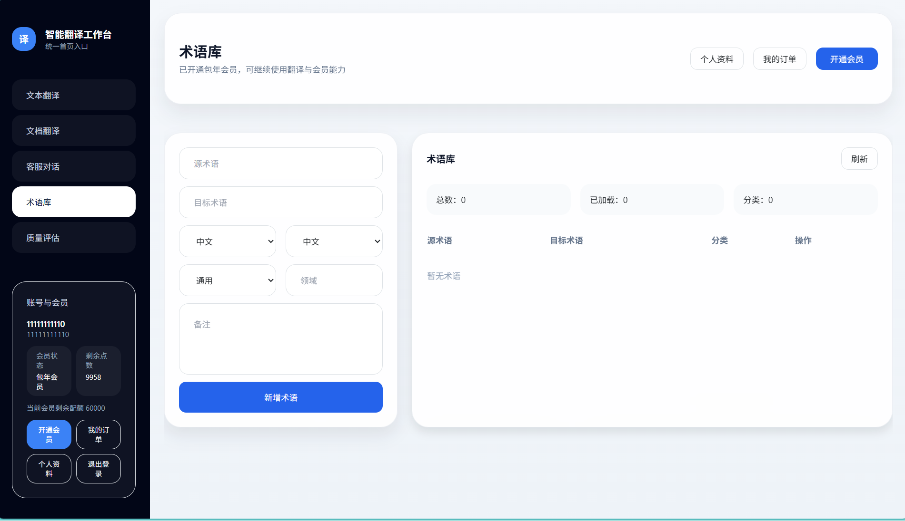
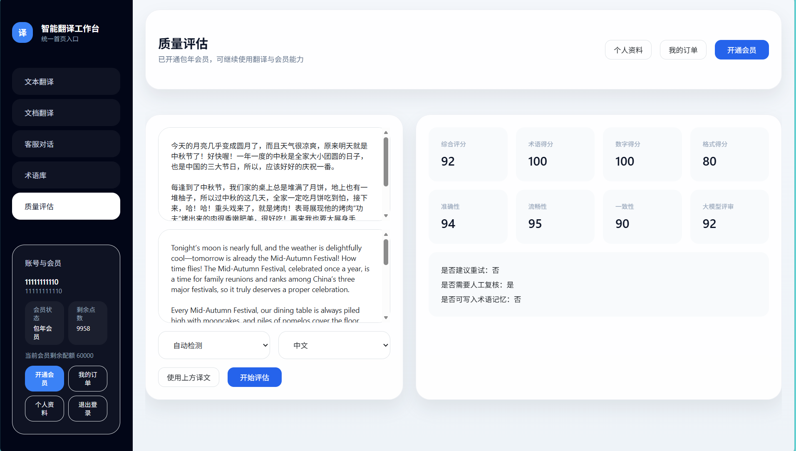

# Translation AI Agent


一个面向翻译与客服场景的 AI Agent 工作流后端项目。

它不是单纯“调用模型 API 的翻译 demo”，而是把文本翻译、文档翻译、客服对话、质量评估、人工复核、术语库、TM 回流、会员订单与 mock 支付等能力，收敛到一条可追踪、可评估、可人工兜底的后端工作流里。

## 项目定位

当前项目主线是：

- Task 化 Workflow SSE
- 质量评估与 Quality Gate
- Human-in-the-loop 人工复核闭环
- review queue 运营能力
- TM 回流与术语一致性增强
- 文档异步处理与客服对话流式体验
- Eval-driven revise loop

当前定位为单 Agent 工作流后端，不刻意包装为多智能体平台，也不为了简历强塞 Function Calling。

## 核心亮点

- 文本翻译从同步 demo 升级为真实 task workflow SSE，标准链路为 `POST /api/agent/tasks/text` + `GET /api/agent/tasks/{taskId}/events`
- 建立固定六类事件模型：`connected`、`snapshot`、`task`、`step`、`result`、`done`
- 在真实持久化 workflow 节点发布 SSE 事件，前端可基于 timeline 展示任务进展，而不是等整条流程结束后才看到结果
- 落地 Quality Gate、人工复核、review queue、review 统计、人工复核结果回流 TM
- 引入 RAG fallback，在术语命中不足或上下文不足时补充检索增强
- 为质量评估链路补充结构化输出收口，支持 `json_schema`、`json_object` 与 `prompt-only` 模式降级，并结合第三方 `json-repair` 提升 JSON 解析稳定性
- 落地 Eval-driven revise loop：初译后先评估，只对硬规则问题做单次自动修正，失败后转人工复核
- 修复 `translationEngine` 参数语义链断裂问题，打通前端引擎选择到真实翻译执行链路
- 首页已接回真实登录、会员、订单、点数与 mock 支付链路，支持展示用户状态与会员状态

## 当前能力概览

### 1. 文本翻译与 Agent 工作流

- 文本翻译任务化，支持创建任务后订阅 SSE 事件流
- `TRANSLATE` step 完成后即可预览译文，不再等待整条流程结束
- 支持 workflow timeline 读取与前端阶段可视化
- 支持不同翻译引擎透传，避免 workflow 改造后参数语义丢失

### 2. 质量治理闭环

- TM 入库闸门 / Quality Gate
- 人工复核闭环
- review queue 运营能力
- review 统计接口
- 人工复核结果回流 TM
- 敏感内容可直接跳过自动修正，进入人工复核
- 质量评估链路支持强类型结构化解析，不再直接依赖 `Map` 反序列化模型输出
- 支持 JSON 提取、第三方 `json-repair` 自愈、单次 repair retry 与 heuristic fallback
- `assessmentDetails` 中补充 `structuredOutputMode`、`structuredOutputPath`、`structuredOutputValid` 等可观测字段，便于排查结构化输出质量

### 3. Eval-driven Revise Loop

当前 revise loop 已真实落地到代码，并并入主 workflow：

`PLAN -> RETRIEVE_TERMINOLOGY -> TRANSLATE -> QUALITY_CHECK(INITIAL) -> [REVISE] -> [QUALITY_CHECK(POST_REVISE)] -> FINALIZE`

设计边界：

- `REVISE` 是 workflow step，不是另起一条 demo 链路
- 只做单次自动修正，最多 1 次
- 第一版仅修硬规则类问题：数字/单位、术语一致性、格式问题
- 第二次质量检查仍失败，则转人工复核
- 敏感内容直接跳过 revise，转人工兜底
- 当前仅对 `selectedModel == QWEN` 启用自动修正
- 数据上保留初稿与修正版，前端也支持“先展示初稿，再收口最终结果”

### 4. 文档翻译

- 支持上传即启动的文档翻译流程
- 支持进度刷新、单任务重试、原文下载、译文下载
- 结合 MinIO 存储文档与结果文件
- 已有 Word / Excel / PPT / PDF / TXT 等文件处理链路

### 5. 客服对话

- 已从“发一句回一句”改造成客服场景
- 支持会话恢复、删除、历史消息查询
- 发送链路切换到 `/api/chat/sessions/{sessionId}/auto-reply`
- 支持 `status / delta / done / failed` 阶段事件
- 前端采用“先阶段状态，再最终回复本地打字机”的流式体验

### 6. 产品化配套能力

- 用户注册登录
- 当前用户信息查询：`/api/users/me`
- 当前会员状态查询：`/api/membership/current`
- 点数余额、会员开通、订单查询
- 支付页保留 mock 支付体验，不强依赖真实支付接入

## Workflow SSE 事件模型

文本翻译主链路：

1. 前端 `POST /api/agent/tasks/text` 创建任务
2. 前端 `GET /api/agent/tasks/{taskId}/events` 订阅事件流
3. 后端在真实 workflow 节点持续发布事件
4. 前端使用 `snapshot` 初始化状态，使用 `step` 渲染 timeline，使用 `result` / `done` 收口任务

六类固定事件：

- `connected`：SSE 连接建立
- `snapshot`：初始化任务快照
- `task`：任务状态变化
- `step`：工作流节点推进
- `result`：最终结果输出
- `done`：事件流完成

## 页面与演示入口

项目提供了完整的 Thymeleaf 页面，可直接演示当前能力：

- `/`：首页，聚合文本翻译、文档翻译、客服对话、术语库、质量评估、账号与会员入口
- `/translate`：文本翻译页，接入真实 task workflow SSE
- `/document`：文档翻译页
- `/chat`：客服对话页
- `/terminology`：术语库页
- `/quality`：质量评估页
- `/membership`：会员开通页
- `/orders`：订单列表页
- `/profile`：个人资料页
- `/login`：登录页

其中支付相关页面为演示链路，默认按 mock 支付方式闭环，不要求实际接入真实支付网关。

## 页面截图

**首页 / 文本翻译**



**文档翻译**



**客服对话**



**术语库**



**质量评估**



## 技术栈

- 后端：Java 21、Spring Boot 3.5.10
- Web：Spring MVC、Thymeleaf、SSE、WebFlux
- AI：Spring AI、阿里云机器翻译、DashScope / Qwen
- 数据层：Spring Data JPA、MySQL
- 缓存：Redis
- 文件处理：Apache POI、PDFBox、MinIO
- 结构化输出处理：JSON Schema、`json-repair`
- 鉴权：JWT、拦截器鉴权
- 其他：测试基于 Spring Boot Test

## 核心模块

- `TranslationController`：文本翻译、批量翻译、流式翻译、润色、语言检测
- `DocumentTranslationController`：文档上传、任务启动、进度查询、结果下载
- `ChatTranslationController`：客服对话、会话恢复、SSE 自动回复
- `TerminologyController`：术语库管理与统计
- `QualityController`：质量评估
- `AgentTaskController`：Agent 任务创建、事件订阅、timeline 读取
- `ReviewTaskController`：人工复核任务流转
- `AuthController` / `CurrentUserController`：登录与当前用户态
- `MembershipController` / `OrderPaymentController` / `PointsController`：会员、订单、点数与 mock 支付

## 目录结构

```text
translation-ai-agent/
├─ src/main/java/cn/net/wanzni/ai/translation
│  ├─ controller
│  ├─ service
│  ├─ service/file
│  ├─ service/impl
│  ├─ service/impl/agent
│  ├─ service/llm
│  ├─ repository
│  ├─ entity
│  ├─ dto
│  ├─ enums
│  └─ config
├─ src/main/resources
│  ├─ templates
│  ├─ static
│  ├─ application.yml
│  └─ application-dev.yml
├─ database
└─ docs
```

## 本地启动

### 环境准备

- JDK 21
- Maven 3.9+
- MySQL 8.x
- Redis
- MinIO

可选依赖：

- Elasticsearch
- DashScope / 阿里云机器翻译相关密钥

### 数据初始化

按需执行 `database/` 下的 SQL 脚本，例如：

- `01_create_tables.sql`
- `02_init_data.sql`
- `03_create_indexes.sql`
- `04_agent_upgrade.sql`

### 配置说明

项目当前使用：

- `src/main/resources/application.yml`
- `src/main/resources/application-dev.yml`

启动前请根据本地环境补齐或覆盖以下配置：

- MySQL 连接
- Redis 连接
- MinIO 连接
- DashScope API Key
- 阿里云机器翻译 AK / SK
- `app.baseUrl`

建议使用本地私有配置或环境变量覆盖敏感信息，不要把真实密钥再次提交到仓库。

### 启动命令

```bash
mvn -q -DskipTests compile
mvn spring-boot:run
```

启动后默认访问：

- [http://localhost:7002/](http://localhost:7002/)

## 测试

项目已针对核心 Agent 工作流链路补充测试，常用命令示例：

```bash
mvn -q "-Dtest=AgentTaskControllerTest,AgentWorkflowServiceImplTest" test
```

## 当前版本说明

相较于最初的翻译 demo，当前版本已经完成这些关键升级：

- 文本翻译升级为真实 task workflow SSE
- 首页与 `translate.html` 已接入 workflow 主链事件
- `translationEngine` 参数语义链修复完成
- 质量评估链路已升级为结构化输出收口方案，支持 `json_schema` / `json_object` / `prompt-only` 模式降级，并引入第三方 `json-repair`
- Eval-driven revise loop 已并入主 workflow
- 首页、会员、订单、个人资料、支付页已重新接回登录态与会员链路
- 支付页保留 mock 支付闭环，适合本地演示

## 说明

- 当前项目更适合作为“AI Agent 工作流后端项目”理解，而不是多智能体平台
- 支付链路以 mock 演示为主，不要求真实支付网关落地
- revise loop 当前只对部分模型与硬规则问题启用，这是有意收敛后的第一版实现
