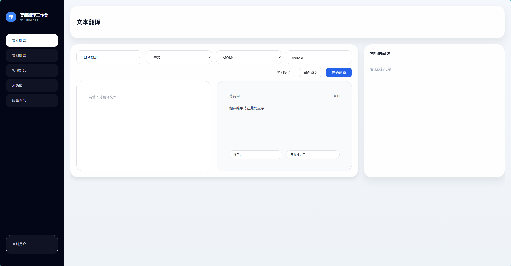
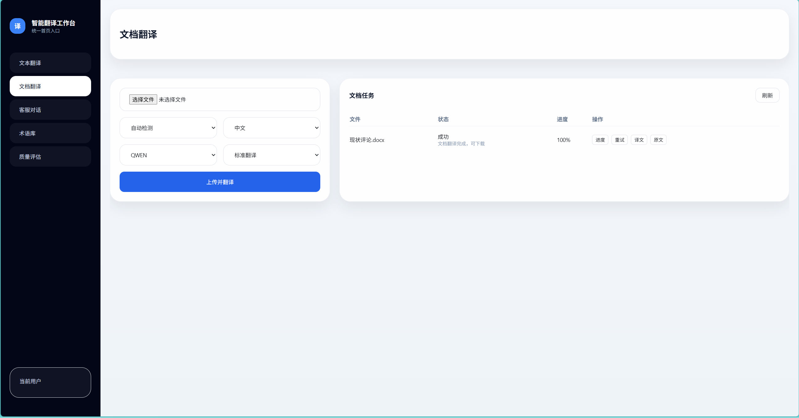
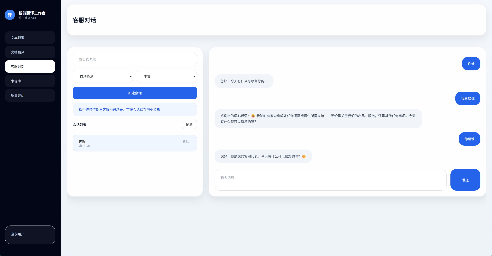
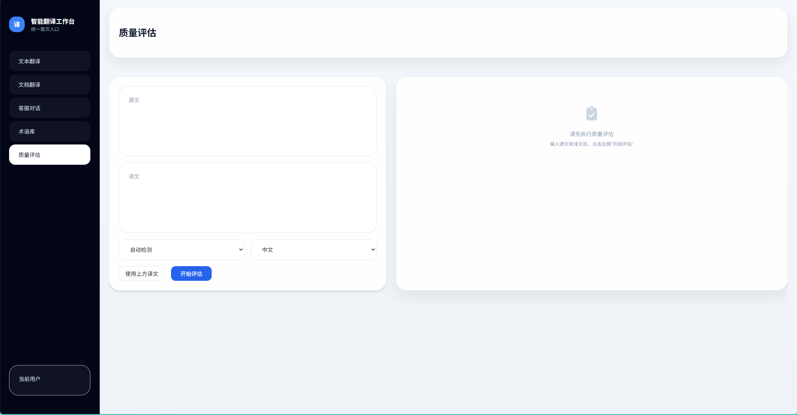

# Translation AI Agent


一个面向实际业务场景的 AI 翻译平台，覆盖文本翻译、文档翻译、实时对话翻译、术语库、质量评估、会员积分与支付能力，并引入 Agent 化翻译流程与流式交互体验。

这个项目不是单一的翻译接口封装，而是一个完整的多模块翻译系统原型，重点展示了 AI 能力接入、业务系统设计、文件处理链路、术语一致性控制，以及面向产品化的后端架构实现。

## 项目亮点

- 支持文本翻译、批量翻译、文档翻译、聊天翻译四类核心场景
- 接入 Spring AI、阿里云机器翻译、Qwen 能力，支持 AI 增强翻译流程
- 内置术语库、润色、质量评估、RAG/Agent 扩展能力
- 支持 SSE 流式输出，适合实时翻译和渐进式结果展示
- 覆盖会员、积分、订单、支付模拟等产品化模块
- 提供完整前端页面模板，便于直接演示和二次开发

## 功能概览

### 1. 文本翻译

- 普通文本翻译
- 批量文本翻译
- 语言检测
- 支持语言对校验
- 翻译引擎列表查询
- 译文润色与术语增强
- SSE 流式翻译输出

### 2. 文档翻译

- 文档上传、任务创建、启动翻译
- 进度查询、结果下载、原文下载
- 支持多种办公文档与 PDF 处理链路
- 集成对象存储，适合中大型文件翻译场景

### 3. 对话翻译

- 会话创建、更新、结束
- 消息发送与历史拉取
- SSE 流式消息翻译
- 自动回复与会话事件流

### 4. 翻译增强能力

- 术语库管理与统计
- 翻译质量评估
- 基于 Prompt 的润色能力
- Agent 任务、步骤、时间线与事件流
- Review 审核任务流转

### 5. 产品化能力

- 手机号注册登录
- 会员订阅
- 点数余额管理
- 下单、预支付、确认支付
- 支付宝/微信模拟支付页面

## 技术栈

- 后端：Java 21、Spring Boot 3.5.10
- Web：Spring MVC、Thymeleaf、WebSocket、SSE
- AI：Spring AI、阿里云机器翻译、Qwen
- 数据层：Spring Data JPA、MySQL
- 缓存与消息：Redis、RocketMQ
- 文件处理：Apache POI、PDFBox、MinIO
- 安全：JWT、拦截器鉴权

## 系统模块

- `TranslationController`：文本翻译、批量翻译、流式翻译、润色、语言检测
- `DocumentTranslationController`：文档上传、任务启动、进度查询、下载
- `ChatTranslationController`：聊天翻译、SSE 会话流、自动回复
- `TerminologyController`：术语库增删改查与统计
- `QualityController`：翻译质量评估
- `AgentTaskController` / `AgentController`：Agent 翻译任务、事件流、步骤追踪
- `AuthController` / `MembershipController` / `OrderPaymentController`：用户、会员、积分、支付链路

## 页面展示

**文本翻译**



**文档翻译**



**客服对话**



**术语库**



**质量评估**


## 目录结构

```text
translation-ai-agent/
├─ src/main/java/cn/net/wanzni/ai/translation
│  ├─ controller
│  ├─ service
│  ├─ service/file
│  ├─ service/impl
│  ├─ service/impl/agent
│  ├─ service/llm
│  ├─ core/agent
│  ├─ repository
│  ├─ entity
│  ├─ dto
│  └─ config
├─ src/main/resources
│  ├─ templates
│  └─ static
├─ database
└─ docs
```

## 本地运行说明

由于仓库中未提交实际运行配置文件和敏感密钥，启动前需要自行补充本地配置，建议防止在`src/main/resources`路径下

**application.yml示例**

```yml
server:
  port: 7002
  servlet:
    context-path: /

# 移动端扫码可访问的主机地址（含端口），用于生成二维码链接中的回调域名
# 本机开发请改为局域网IP，如：app.base-url: http://192.168.1.10:7002

spring:
  application:
    name: translation-ai-agent
  profiles:
    active: dev

  # 数据源配置 - 使用H2内存数据库进行开发测试
  datasource:
    url: jdbc:mysql://localhost:3306/translation?useUnicode=true&characterEncoding=utf8&serverTimezone=UTC&useSSL=false&allowPublicKeyRetrieval=true
    driver-class-name: com.mysql.cj.jdbc.Driver
    username: your username
    password: your password

  # JPA配置
  jpa:
    hibernate:
      ddl-auto: update
    show-sql: true
    properties:
      hibernate:
        format_sql: true
        dialect: org.hibernate.dialect.MySQLDialect

  # Redis配置
  data:
    redis:
      database: 2
      host: your host
      port: 6379
      password: your password
      timeout: 10000ms
      lettuce:
        pool:
          max-active: 20
          max-idle: 10
          min-idle: 5
          max-wait: 5000ms

    # Elasticsearch配置
    elasticsearch:
      repositories:
        enabled: true
      uris: your uris

  # Thymeleaf配置
  thymeleaf:
    cache: false
    encoding: UTF-8
    mode: HTML
    prefix: classpath:/templates/
    suffix: .html

  # WebSocket配置
  websocket:
    allowed-origins: "*"

  # 文件上传配置
  servlet:
    multipart:
      max-file-size: 50MB
      max-request-size: 100MB

# AI服务配置
ai:
  # 通义千问（DashScope）配置（用于文本翻译）
  dashscope:
    enabled: ${ai.dashscope.enabled:false}
    api-key: ${ai.dashscope.api-key:your api-key}
    chat:
      options:
        model: ${ai.dashscope.chat.options.model:qwen3-max}
        temperature: ${ai.dashscope.chat.options.temperature:0.7}

  # 阿里云翻译配置
  aliyun:
    access-key-id: ${ai.aliyun.access-key-id:your access-key-id}
    access-key-secret: ${ai.aliyun.access-key-secret:your access-key-secret}
    region: ${ai.aliyun.region:cn-hangzhou}
    endpoint: ${ai.aliyun.endpoint:mt.cn-hangzhou.aliyuncs.com}

# MinIO配置
minio:
  endpoint: your url
  bucketName: translation-dev
  secure: false
  accessKey: your key
  secretKey: your secret

# 应用配置
app:
  baseUrl: ${APP_BASE_URL:http://localhost:7002}
  # 翻译配置
  translation:
    # 支持的语言列表
    supported-languages:
      - code: zh
        name: 中文
        native-name: 中文
      - code: en
        name: 英语
        native-name: English
      - code: ja
        name: 日语
        native-name: 日本語
      - code: ko
        name: 韩语
        native-name: 한국어
      - code: fr
        name: 法语
        native-name: Français
      - code: de
        name: 德语
        native-name: Deutsch
      - code: es
        name: 西班牙语
        native-name: Español
      - code: ru
        name: 俄语
        native-name: Русский

    # 翻译质量评估配置
    quality:
      enabled: true
      threshold: 0.8
      dimensions:
        - accuracy
        - fluency
        - consistency
        - completeness

    # 缓存配置
    cache:
      enabled: true
      ttl: 3600 # 缓存时间（秒）
      max-size: 10000 # 最大缓存条目数

  # 文档处理配置
  document:
    # 支持的文档格式
    supported-formats:
      - pdf
      - doc
      - docx
      - xls
      - xlsx
      - ppt
      - pptx
      - txt

    # 文档大小限制（MB）
    max-size: 50

    # 处理超时时间（秒）
    timeout: 300

  # MQ开关（RocketMQ监听是否启用）
  mq:
    enabled: ${APP_MQ_ENABLED:false}

  # 会员与点数配置
  membership:
    monthly-quota: 5000
    subscribe-bonus-points: 5000
  points:
    text-deduction: 1
    document-deduction: 10

# 日志配置
logging:
  level:
    com.ai.translation: DEBUG
    cn.net.wanzni.ai.translation: DEBUG
    cn.net.wanzni.ai.translation.service.impl.DocumentTranslationServiceImpl: DEBUG
    org.springframework.ai: DEBUG
    org.springframework.data.elasticsearch: DEBUG
    org.apache.pdfbox.pdmodel.font.FileSystemFontProvider: ERROR
    org.apache.fontbox: ERROR
    # Hibernate SQL 与参数绑定日志（覆盖不同版本的Hibernate）
    org.hibernate.SQL: DEBUG
    org.hibernate.type.descriptor.sql: TRACE
    org.hibernate.type.descriptor.jdbc: TRACE
    org.hibernate.orm.jdbc.bind: TRACE
    org.hibernate.stat: DEBUG
  pattern:
    console: "%d{yyyy-MM-dd HH:mm:ss} [%thread] %-5level %logger{36} - %msg%n"
    file: "%d{yyyy-MM-dd HH:mm:ss} [%thread] %-5level %logger{36} - %msg%n"
  file:
    name: logs/translation-assistant.log

# 管理端点配置
management:
  endpoints:
    web:
      exposure:
        include: health,info,metrics,prometheus
  endpoint:
    health:
      show-details: always
  metrics:
    prometheus:
      metrics:
        export:
          enabled: true

        # RocketMQ配置（如本地未部署RocketMQ，发送失败将被捕获不影响下单）
rocketmq:
  name-server: your url
  producer:
    group: translation-ai-agent-producer

# 支付配置（真实接入需填写以下参数）
pay:
  alipay:
    enabled: true
    sandbox: ${PAY_ALIPAY_SANDBOX:true}
    app-id: ${PAY_ALIPAY_APP_ID:}
    merchant-private-key: ${PAY_ALIPAY_PRIVATE_KEY:}
    alipay-public-key: ${PAY_ALIPAY_PUBLIC_KEY:}
    notify-url: ${PAY_ALIPAY_NOTIFY_URL:http://localhost:${server.port}/api/payment/notify/alipay}
  wechat:
    enabled: true
    app-id: ${PAY_WECHAT_APP_ID:}
    mchid: ${PAY_WECHAT_MCHID:}
    merchant-serial-number: ${PAY_WECHAT_SERIAL_NO:}
    api-v3-key: ${PAY_WECHAT_API_V3_KEY:}
    private-key-path: ${PAY_WECHAT_PRIVATE_KEY_PATH:}
    notify-url: ${PAY_WECHAT_NOTIFY_URL:http://localhost:${server.port}/api/payment/notify/wechat}
chat:
  sse:
    executor:
      # 线程池核心线程数
      core-pool-size: 8
      # 线程池最大线程数
      max-pool-size: 20
      # 有界队列容量，避免无界排队导致内存膨胀
      queue-capacity: 500
      # 空闲线程保活秒数
      keep-alive-seconds: 60
      # 关闭时是否等待任务完成
      wait-for-tasks-to-complete-on-shutdown: true
      # 关闭等待的最大秒数
      await-termination-seconds: 5
      # 是否允许核心线程超时
      allow-core-thread-time-out: false
      # 线程名前缀，便于日志观测
      thread-name-prefix: "chat-sse-"
```

### 建议准备

- JDK 21
- Maven 3.9+
- MySQL 8.0+
- Redis 6.0+
- MinIO
- 阿里云翻译相关密钥
- Qwen / Spring AI 相关配置

### 启动步骤

```bash
mvn -q -DskipTests compile
mvn -q -DskipTests spring-boot:run
```

启动后可从首页及各业务页面进入演示流程。

---

